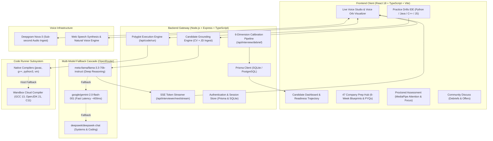

# TeLos® • Real-Time AI Technical Interview & Verified Assessment Platform

<div align="center">

```
  _______   ______ _      ____   _____ 
 |__   __| / _____| |    / __ \ / ____|
    | |___| |__   | |   | |  | | (___  
    | / _ \  __|  | |   | |  | |\___ \ 
    | |  __/ |____| |___| |__| |____) |
    |_|\___|______|______\____/|_____/ 
```

**Real Systems. Deep Trade-Offs. Multi-Language Execution. Zero Canned Trivia.**

[](https://www.typescriptlang.org/)
[](https://react.dev/)
[](https://vitejs.dev/)
[](https://expressjs.com/)
[](https://www.prisma.io/)
[](https://adoptium.net/)
[](https://gcc.gnu.org/)
[](LICENSE)

[Live Architecture](#-architecture-blueprint) • [Core Capabilities](#-core-capabilities) • [47 Company Blueprints](#-47-company-prep-blueprints) • [Polyglot Runner](#-polyglot-execution-engine) • [System Limitations](#-system-limitations--engineering-constraints) • [Quick Start](#-quick-start)

</div>

---

## ⚡ Overview

**TeLos®** is an intelligent, voice-first technical interview simulation and verified candidate assessment platform. Engineered for software engineers, university candidates, and system architects, TeLos bridges the gap between solitary LeetCode grinding and high-stakes technical screens at top global tech companies and product unicorns.

Unlike standard chatbots or generic LLM wrappers, TeLos actively grounds the conversation in **your real resume projects, architecture choices, and target job descriptions**—challenging concurrency models, distributed bottlenecks, failure modes, and speaking cadence in real time.

---

## 🏛️ Architecture Blueprint



---

## 🚀 Core Capabilities

### 1. 🎙️ Live Conversational Interview Studio with Alex
* **Zero Scripted Trivia**: Alex dynamically extracts your actual CV achievements and targets your specific architectural bottlenecks.
* **Sub-Second Latency**: Bidirectional streaming speech recognition via Deepgram Nova-3 combined with fast LLM token streaming.
* **Barge-In Interruptibility (`✋ INTERRUPT ALEX`)**: Cut audio playback at any millisecond to naturally clarify assumptions or pivot your explanation.
* **Acoustic Voice Orb**: High-fidelity 3D/canvas multi-layer visualizer indicating real-time audio energy and speaking states.

### 2. 📊 Live Speech Telemetry HUD
* **Speaking Pace (WPM)**: Live words-per-minute meter categorized into:
  * `Optimal (130–160 WPM)`
  * `Deliberate / Slow (<115 WPM)`
  * `Fast / Rushed (>170 WPM)`
* **Vocal Filler Decay**: Real-time identification and tallying of verbal ticks (*"um"*, *"like"*, *"basically"*, *"you know"*).
* **Talk-to-Listen Ratio**: Balances candidate explanation vs interviewer prompts.

### 3. 📈 6-Dimension Calibration Debrief & Scorecard
* **Hiring Verdict Badge**: Instant recommendation (*Strong Hire*, *Hire*, *Leaning Hire*, *No Hire*) with rationale.
* **6-Gauge Radar Scorecard**:
  1. *Overall Readiness*
  2. *Technical Depth & Rigor*
  3. *Systems Architecture & Concurrency*
  4. *Communication & STAR Structure*
  5. *Edge Cases & Failure Recovery*
  6. *Speaking Cadence & Delivery*
* **"What You Said" vs "Ideal High-Bar Response"**: Side-by-side diff showing how to elevate junior answers into Staff-level architectural reasoning.
* **Anti-Pattern Traps**: Flags vague buzzwords, unaddressed single points of failure, or premature optimizations.
* **48-Hour Action Roadmap**: Prioritized 3-day recovery plan with target practice problems.
* **1-Click Markdown Export**: Download session scorecards directly as `.md`.

---

## 🏢 47 Company Prep Blueprints

TeLos includes 47 deep-dive preparation roadmaps with authentic hiring round breakdowns, collapsible 6-week milestones, deliverables, and authentic past year questions (PYQs):

```
├── Global Tech Giants (17 Companies)
│   ├── Google, Amazon, Meta, Microsoft, Apple, Netflix
│   ├── Uber, Stripe, Atlassian, Adobe, Salesforce
│   ├── Databricks, Snowflake, OpenAI, Airbnb, ByteDance (TikTok), Palantir
│
└── Indian Tech & Fintech Product Giants (30 Companies)
    ├── Razorpay, Flipkart, Swiggy, Zomato, PhonePe, Cred, Zerodha, Zoho
    ├── Meesho, Ola, Juspay, Groww, Urban Company, InMobi, Postman, BrowserStack
    ├── Delhivery, Nykaa, Zepto, Blinkit, PayU, Slice, Navi, Clevertap
    └── Khatabook, Sprinklr, Dream11, ShareChat, Cars24, Porter
```

---

## 💻 Polyglot Execution Engine

The Drills Workbench (`/bank`) provides 24 curated company algorithmic challenges backed by a zero-configuration polyglot runner:

| Language | Environment | Execution Strategy |
| :--- | :--- | :--- |
| **Python 3** | Python 3.10+ | Native subprocess with timeout & sandbox limits |
| **Java** | OpenJDK 21 | Native single-file launch / `javac` with automated cloud compiler fallback |
| **C++** | GCC 13.2 / Clang | `-std=c++17 -O2` with multi-binary alias probing & cloud compiler fallback |
| **C** | GCC 13.2 / Clang | `-std=c11 -O2` compilation |
| **JavaScript** | V8 VM Engine | Sandboxed in-process V8 VM with console logger proxy |

> [!TIP]
> **Zero Host Dependency Errors:** If deployed on a minimal container without native `g++` or `javac` installed, the runner automatically delegates to the **Wandbox High-Speed Compiler API**, ensuring code executes with zero configuration.

---

## 🛡️ Verified Proctored Assessment

For recruiting teams and candidates seeking verified skill validation:
* **Hardware Preflight**: Real-time microphone and camera check-in.
* **Focus & Attention Tracking**: Head pose and gaze tracking via MediaPipe vision tasks.
* **Clipboard Protection**: Intercepts unauthorized copy/cut/paste attempts.
* **Immutable Signal Audit**: Logs focus-loss events and window blurs for verifiable assessment reports.

---

## ⚠️ System Limitations & Engineering Constraints

To ensure transparent expectations, the following architectural and runtime constraints are inherent to the platform:

1. **Browser Speech & Microphone Compatibility:**
   - Real-time in-browser speech recognition relies on the **Web Speech API** (which has the highest stability on Chromium-based browsers like Chrome, Edge, and Brave) or the **Deepgram Nova-3 API**.
   - Safari and Firefox utilize standard Web Speech Synthesis and fallback audio mechanisms.

2. **Proctoring & Vision AI Environment:**
   - MediaPipe head-pose and gaze attention monitoring execute **entirely client-side** using WebAssembly and WebGL.
   - Attention accuracy can vary depending on local lighting, camera angle, and hardware acceleration capabilities. It is designed as an ambient integrity metric rather than biometric forensic surveillance.

3. **Sandboxed Code Execution Scope:**
   - The code runner is scoped specifically for single-file algorithmic problems and standard libraries (`STL`, `java.util.*`, `collections`, `math`).
   - For security, network sockets, file system writes, multi-threaded server listening, and subprocess execution from within candidate code are disallowed and constrained by a **6,000 ms timeout**.

4. **LLM Evaluation & Rubric Variance:**
   - Post-interview scorecards, radar metrics, and feedback diffs are synthesized using large language models grounded on company rubrics.
   - While tightly calibrated, candidates should use evaluations as high-signal deliberate practice rather than a legally binding hiring committee outcome.

---

## 🚦 Quick Start

### 1. Clone & Install
```bash
git clone https://github.com/piyush23-eng/TeLos.git
cd TeLos
npm install
```

### 2. Environment Configuration
Create a `.env` file in the root directory:
```env
PORT=8787
VITE_API_BASE_URL=http://localhost:8787

# OpenRouter Multi-Model Key (Required for live AI interviews)
OPENROUTER_API_KEY=your_openrouter_api_key_here
OPENROUTER_MODEL=meta-llama/llama-3.3-70b-instruct

# Deepgram Speech-to-Text (Optional for enhanced voice accuracy)
DEEPGRAM_API_KEY=your_deepgram_api_key_here
```

### 3. Database Initialization
```bash
npx prisma db push
npm run seed
```

### 4. Run Locally
```bash
npm run dev
```
* **Frontend Web App**: `http://localhost:5173`
* **Backend Gateway**: `http://localhost:8787`

---

## 📁 Repository Structure

```
TeLos/
├── server/
│   ├── index.ts              # Express API gateway, auth, & SSE streaming routes
│   ├── intelligence.ts       # OpenRouter client & multi-model fallback cascade
│   ├── runner.ts             # Polyglot code runner (Python, Java, C++, JS + Cloud fallback)
│   └── mockData.ts           # Practice catalog, personas & analytics
├── src/
│   ├── components/
│   │   └── VoiceOrbVisualizer.tsx  # Multi-layer acoustic voice visualizer
│   ├── App.tsx               # Main application orchestration & state container
│   ├── Assessment.tsx        # Proctored technical assessment interface
│   ├── AuthModal.tsx         # Authentication modal & candidate profile access
│   ├── UserDashboard.tsx     # Candidate interview ledger & telemetry stats
│   ├── companyPrepData.ts    # 47 Curated company interview playbooks & PYQs
│   ├── voiceMetrics.ts       # WPM cadence math, filler parser & MD exporter
│   ├── roadmap.css           # Modern brutalist design system & dark mode
│   └── styles.css            # Base utility styles
├── prisma/
│   ├── schema.prisma         # User, Session, Question, Score schemas
│   └── seed.ts               # Starter candidate telemetry seed data
├── scripts/
│   └── setup-jdk.mjs         # OpenJDK 17 automated Linux bootstrapper
├── Dockerfile                # Multi-stage production container with GCC & OpenJDK
├── render.yaml               # Render infrastructure blueprint
└── package.json              # Project dependencies & build scripts
```

---

## 🤝 Contributing

Contributions are warmly welcomed! To contribute:

1. Fork the repository.
2. Create your Feature Branch (`git checkout -b feat/NewCompanyBlueprint`).
3. Commit your Changes (`git commit -m 'feat: add Netflix distributed systems roadmap'`).
4. Push to the Branch (`git push origin feat/NewCompanyBlueprint`).
5. Open a Pull Request.

---

## 📜 License

Distributed under the **MIT License**. See `LICENSE` for more information.

<div align="center">
<sub>Built with precision for engineers launching breakthrough tech careers. © 2026 TeLos Studio.</sub>
</div>
