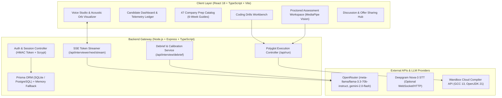

# TeLos • Technical Interview Practice & Proctored Assessment Platform

<div align="center">

```
  _______   ______ _      ____   _____ 
 |__   __| / _____| |    / __ \ / ____|
    | |___| |__   | |   | |  | | (___  
    | / _ \  __|  | |   | |  | |\___ \ 
    | |  __/ |____| |___| |__| |____) |
    |_|\___|______|______\____/|_____/ 
```

**Voice-enabled technical interview simulation, company prep roadmaps, polyglot code execution, and proctored coding assessments.**

[](https://github.com/piyush23-eng/TeLos/actions/workflows/ci.yml)
[](https://www.typescriptlang.org/)
[](https://react.dev/)
[](https://vitejs.dev/)
[](https://expressjs.com/)
[](https://www.prisma.io/)
[](LICENSE)

[Architecture](#architecture) • [Features](#features) • [Company Catalog](#company-prep-catalog) • [Code Execution](#code-execution-engine) • [System Limitations](#system-limitations--constraints) • [Local Setup](#local-development-setup) • [Project Structure](#project-structure)

</div>

---

## Overview

TeLos is a full-stack web application designed for software engineering interview preparation and technical assessment. It provides:

1. **AI-Driven Voice Interviews:** Dynamic technical discussions with an AI interviewer using streaming LLMs and speech synthesis/recognition.
2. **Speech & Delivery Telemetry:** Client-side tracking of speaking rate (WPM) and filler word frequency.
3. **Structured Calibration Reports:** Automated session debriefs providing evaluation across 6 dimensions, answer comparisons, and structured feedback.
4. **47 Company Preparation Guides:** Multi-week preparation schedules and past interview questions categorized by company.
5. **Polyglot Code Runner:** Single-file execution sandbox supporting Python, Java, C++, C, and JavaScript with local and remote compiler fallbacks.
6. **Proctored Coding Assessments:** Timed technical problem sets with client-side gaze/face monitoring (MediaPipe), clipboard restrictions, and event logging.

---

## Architecture



---

## Features

### 1. Conversational Voice Studio
* **Adaptive Questioning:** Generates follow-up questions based on the candidate\'s resume, target company, focus domain, and previous answers in the transcript.
* **Server-Sent Events (SSE):** Streams LLM token responses for reduced perceived latency.
* **Barge-In Interrupt:** Allows candidates to stop the interviewer\'s audio playback at any point to speak or clarify requirements.
* **Acoustic Visualizer:** Canvas-rendered multi-layer audio visualizer showing current microphone and speaker states.

### 2. Delivery Telemetry & Calibration Debriefs
* **Pacing & Cadence:** Measures words-per-minute (WPM) throughout answers.
* **Filler Word Tracking:** Identifies verbal hesitation markers (*"um"*, *"like"*, *"basically"*, *"you know"*).
* **6-Dimension Evaluation:** Scores sessions across Overall Readiness, Technical Depth, Systems Architecture, Communication, Edge Cases, and Speaking Cadence.
* **Answer Comparisons:** Provides structured before/after examples contrasting common responses with more detailed architectural answers.
* **Markdown Export:** Generates downloadable session summaries formatted as `.md`.

### 3. Company Prep Catalog
Includes curated 6-week preparation roadmaps and past interview topics across **47 tech companies**:
* **17 Global Technology Companies:** Google, Amazon, Meta, Microsoft, Apple, Netflix, Uber, Stripe, Atlassian, Adobe, Salesforce, Databricks, Snowflake, OpenAI, Airbnb, ByteDance, Palantir.
* **30 Indian Product & Fintech Companies:** Razorpay, Flipkart, Swiggy, Zomato, PhonePe, Cred, Zerodha, Zoho, Meesho, Ola, Juspay, Groww, Urban Company, InMobi, Postman, BrowserStack, Delhivery, Nykaa, Zepto, Blinkit, PayU, Slice, Navi, Clevertap, Khatabook, Sprinklr, Dream11, ShareChat, Cars24, Porter.

### 4. Proctored Coding Assessments
* **Hardware Preflight:** Verifies camera and microphone access prior to entering the assessment.
* **Client-Side Landmark Tracking:** Uses MediaPipe FaceLandmarker in WebAssembly to track head orientation and eye gaze locally in the browser.
* **Integrity Constraints:** Restricts clipboard copy/paste, tracks tab/window focus losses, and logs events for session auditing.
* **Multi-Question Environment:** Timed coding interface supporting C, C++, Java, Python 3, and JavaScript.

---

## Code Execution Engine

The platform includes a sandboxed execution engine for algorithmic problems:

| Language | Local Runtime | Cloud Fallback | Sandbox Mechanism |
| :--- | :--- | :--- | :--- |
| **JavaScript** | Node.js `node:vm` | — | Isolated V8 context with memory limits & console proxy |
| **Python 3** | `python3` subprocess | Wandbox API | Child process with timeout constraints |
| **C++** | `g++` / `clang++` (`-std=c++17 -O2`) | Wandbox GCC 13.2 | Compilation subprocess with execution wrapper |
| **C** | `gcc` / `clang` (`-std=c11 -O2`) | Wandbox GCC 13.2 | Compilation subprocess with execution wrapper |
| **Java** | `javac` / OpenJDK 17/21 | Wandbox OpenJDK 21 | Source-file execution via subprocess |

* **Execution Timeout:** All runs are constrained to a 6,000 ms execution window.
* **Fallback Strategy:** If local compilers are unavailable on the host system, execution automatically routes to the Wandbox Cloud API.

---

## System Limitations & Constraints

1. **Browser Speech Recognition:**
   - Client-side transcription depends on browser support for the Web Speech API (primarily Chrome, Edge, and Chromium-based browsers) or the optional Deepgram Nova-3 API.
   - Safari and Firefox fall back to standard Web Speech Synthesis and native audio controls.

2. **Client-Side Attention Monitoring:**
   - Facial landmark processing runs in WebAssembly via MediaPipe. Detection accuracy depends on candidate lighting, camera quality, and client CPU/GPU capabilities.
   - It is intended as an ambient integrity metric, not biometric verification.

3. **Code Execution Scope:**
   - The execution sandbox is built for single-file algorithmic programs and standard library modules (`math`, `collections`, `java.util.*`, C++ STL).
   - Network access, filesystem persistence, long-running processes, and OS-level syscalls are restricted within user code.

4. **Evaluation Calibration:**
   - Interview scores and feedback are synthesized by LLMs using structured rubrics. They should be treated as automated practice metrics rather than official hiring decisions.

---

## Local Development Setup

### Prerequisites
* **Node.js**: `v20.x` or later
* **npm**: `v10.x` or later
* **Compilers (Optional for local code runs):** `python3`, `g++`, `javac` (otherwise Wandbox fallback is used)

### 1. Clone the Repository
```bash
git clone https://github.com/piyush23-eng/TeLos.git
cd TeLos
npm install
```

### 2. Configure Environment Variables
Create a `.env` file in the root directory:
```env
PORT=8787
DATABASE_URL="file:./dev.db"

# OpenRouter API Key (for LLM interviewer & debrief generation)
OPENROUTER_API_KEY=your_openrouter_api_key_here
OPENROUTER_MODEL=meta-llama/llama-3.3-70b-instruct

# Deepgram STT (Optional)
DEEPGRAM_API_KEY=your_deepgram_api_key_here
```

### 3. Initialize Database Schema
```bash
npx prisma db push
npm run seed
```

### 4. Run Automated Tests
```bash
npm test
```

### 5. Start Development Server
```bash
# Starts both frontend (Vite :5173) and backend API (Express :8787)
npm run dev
```

---

## Project Structure

```
TeLos/
├── server/
│   ├── index.ts              # Express API router, auth handlers, & SSE streaming
│   ├── intelligence.ts       # LLM provider orchestration & multi-model fallback
│   ├── runner.ts             # Polyglot sandbox runner & Wandbox cloud fallback
│   ├── intelligence.test.ts  # Tests for model selection & classification
│   ├── runner.test.ts        # Tests for polyglot code execution
│   └── mockData.ts           # Problem catalog, personas & analytics
├── src/
│   ├── components/
│   │   └── VoiceOrbVisualizer.tsx  # Canvas-based acoustic voice orb visualizer
│   ├── App.tsx               # Primary application UI & routing container
│   ├── Assessment.tsx        # Proctored coding assessment interface
│   ├── AuthModal.tsx         # User authentication & candidate profile dialog
│   ├── UserDashboard.tsx     # Candidate telemetry history & profile management
│   ├── apiConfig.ts          # Centralized API URL resolution & safe storage
│   ├── companyPrepData.ts    # 47 Curated company interview playbooks
│   ├── problemCatalog.ts     # 24 Practice problems with test cases
│   ├── voiceMetrics.ts       # WPM cadence math, filler parser & report exporter
│   ├── voiceMetrics.test.ts  # Tests for WPM math and filler word parsing
│   ├── roadmap.css           # UI styling, layouts, and dark mode theme
│   └── styles.css            # Base styles and reset
├── prisma/
│   ├── schema.prisma         # Data models for User, Session, Question, Score
│   └── seed.ts               # Telemetry and problem dataset seeder
├── .github/
│   └── workflows/
│       └── ci.yml            # CI workflow for automated testing and typechecks
├── Dockerfile                # Multi-stage production container definition
├── render.yaml               # Render cloud deployment blueprint
└── package.json              # Dependencies, build, and test scripts
```

---

## License

This project is licensed under the [MIT License](LICENSE).
