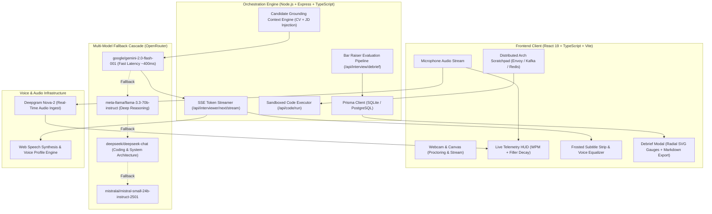

# TeLos • Real-Time AI Technical Interview Studio

<div align="center">

```
  _______   ______ _      ____   _____ 
 |__   __| / _____| |    / __ \ / ____|
    | |___| |__   | |   | |  | | (___  
    | / _ \  __|  | |   | |  | |\___ \ 
    | |  __/ |____| |___| |__| |____) |
    |_|\___|______|______\____/|_____/ 
```

**Real Systems. Deep Trade-Offs. Zero Canned Trivia.**

[](https://www.typescriptlang.org/)
[](https://react.dev/)
[](https://vitejs.dev/)
[](https://expressjs.com/)
[](https://www.prisma.io/)
[](LICENSE)
[](https://render.com/deploy?repo=https://github.com/piyush23-eng/TeLos)

[Live Architecture](#-architecture-blueprint) • [Core Capabilities](#-core-capabilities) • [Quick Start](#-quick-start) • [Environment Setup](#-environment-configuration) • [Debrief Rubric](#-calibrated-scoring-rubric)

</div>

---

## ⚡ Overview

**TeLos** is an open-source, proctored AI technical interview studio engineered for **college students, new grads, campus placement seekers, and software engineering candidates at every stage**—from cracking your dream tech internship or entry-level SDE-1 role to leveling up into core systems and senior architecture.

Unlike generic LLM wrappers that ask canned interview trivia, TeLos actively parses your **real resume projects, college hackathon builds, tech stack choices, and target job descriptions** to challenge core CS fundamentals, algorithms, system design trade-offs, and behavioral experiences in real time.

---

## 🏛️ Architecture Blueprint



---

## 🚀 Core Capabilities

### 1. 🎙️ Real-Time Project Grounding & Conversational Stage
* **Zero Scripted Trivia**: Alex dynamically extracts your actual CV achievements (e.g. *Lucas RAG pipeline*, *Qwen fine-tuning*, *PySpark batch jobs*, *Kafka cluster partitioning*) and targets your specific architectural bottlenecks.
* **Natural Barge-In Interruptibility (`✋ INTERRUPT ALEX`)**: Cut TTS playback at any millisecond to naturally interject, clarify assumptions, or pivot your answer without desyncing the session.
* **Voice Activity Equalizer**: Replaced legacy graphics with a sleek 5-bar sinusoidal voice visualizer indicating live audio energy and mute state.

### 2. 📊 Live Speech Telemetry HUD
* **Speaking Pace (WPM)**: Live words-per-minute meter categorized into:
  * `Optimal (130–160 WPM)`
  * `Deliberate / Slow (<115 WPM)`
  * `Fast / Rushed (>170 WPM)`
* **Vocal Filler Counter**: Real-time identification and tallying of verbal ticks (*"um"*, *"like"*, *"basically"*, *"you know"*).

### 3. 🏗️ Distributed Systems Architecture Scratchpad
Collapsible on-demand scratchpad with 1-click distributed architecture templates:
* `+ API Gateway` *(Envoy / Kong token-bucket rate limiting & JWT auth)*
* `+ Kafka Queue` *(Partitioned event streams & consumer lag handling)*
* `+ Redis Cache` *(Multi-tier write-through cache with TTLs)*
* `+ Sharded DB` *(Consistent hashing router & read replicas)*
* `+ Worker` *(Idempotent distributed transaction saga coordinators)*
* `+ Load Balancer` *(L4/L7 health-checked traffic routing)*

### 4. 📈 Post-Interview Debrief & Senior Ideal Answer Diff
* **Radial SVG Score Gauges**: Linear/Apple-style circular gauges for *Overall Readiness*, *Technical Depth*, *Problem Solving*, and *Communication*.
* **"What You Said" vs "What You Should Say"**: Granular side-by-side comparison showing how to elevate junior explanations into high-bar senior architectural reasoning.
* **What NOT To Say**: Anti-pattern detector highlighting hedging, vague terminology, or unaddressed single points of failure.
* **1-Click Export**: Download clean `.md` Markdown scorecards or generate printable recruiter-ready PDFs.

---

## 🛠️ Tech Stack

| Layer | Technology | Purpose |
| :--- | :--- | :--- |
| **Frontend** | React 19, TypeScript, Vite | Zero-latency reactive user interface |
| **Styling** | Custom Editorial Brutalist CSS | Precision typography (`DM Serif Display`, `Manrope`, `DM Mono`) |
| **Backend** | Express 4, TypeScript, `tsx` | High-throughput streaming REST & SSE gateway |
| **Database** | Prisma ORM with SQLite (Dev) / Postgres (Prod) | Structured session transcripts & telemetry persistence |
| **AI Layer** | OpenRouter (`gemini-2.0-flash`, `llama-3.3-70b`, `deepseek`) | Multi-model fallback intelligence & candidate grounding |
| **Speech** | Web Speech API, Deepgram Nova-2 | Bidirectional streaming speech recognition & synthesis |
| **Charts** | Recharts | Answer quality trends and filler word decay curves |

---

## 🚦 Quick Start

### 1. Clone the Repository
```bash
git clone https://github.com/piyush23-eng/TeLos.git
cd TeLos
```

### 2. Install Dependencies
```bash
npm install
```

### 3. Configure Environment
Create a `.env` file in the project root:
```env
PORT=8787
VITE_API_BASE_URL=http://localhost:8787

# OpenRouter Multi-Model Intelligence (Recommended)
OPENROUTER_API_KEY=your_openrouter_api_key_here
OPENROUTER_MODEL=google/gemini-2.0-flash-001

# Deepgram Speech-to-Text (Optional for enhanced voice accuracy)
DEEPGRAM_API_KEY=your_deepgram_api_key_here

# Google OAuth (Optional)
GOOGLE_CLIENT_ID=your_google_client_id_here
VITE_GOOGLE_CLIENT_ID=your_google_client_id_here
```

### 4. Initialize Database
```bash
npx prisma db push
npm run seed
```

### 5. Launch Development Server
```bash
npm run dev
```
* **Frontend Web App**: `http://localhost:5173`
* **Backend API Gateway**: `http://localhost:8787`

---

## 📁 Repository Structure

```
TeLos/
├── server/
│   ├── index.ts              # Express API gateway, auth, & SSE streaming routes
│   ├── intelligence.ts       # OpenRouter client & multi-model fallback cascade
│   └── mockData.ts           # Practice catalog, seeded personas & analytics
├── src/
│   ├── components/
│   │   └── VoiceOrbVisualizer.tsx # Multi-layer acoustic voice visualizer
│   ├── App.tsx               # Main application orchestration & state container
│   ├── Assessment.tsx        # Proctored technical assessment interface
│   ├── AuthModal.tsx         # OAuth2 (Google / Email) authentication modal
│   ├── UserDashboard.tsx     # Candidate interview ledger & telemetry stats
│   ├── companyPrepData.ts    # Curated company interview playbooks
│   ├── voiceMetrics.ts       # WPM cadence math, filler word parser & MD exporter
│   ├── roadmap.css           # Editorial brutalist design system
│   └── styles.css            # Base utility styles
├── prisma/
│   └── schema.prisma         # Session, Question, Score, and User schemas
├── package.json              # Project scripts & dependency declarations
└── tsconfig.json             # Strict TypeScript compiler configuration
```

---

## 📊 Calibrated Scoring Rubric

Candidates are evaluated adaptively across four core engineering dimensions:

```
┌──────────────────────────────┬───────────────┬────────────────────────────────────────────────────────┐
│ Dimension                    │ Target Bar    │ Evaluation Criteria                                    │
├──────────────────────────────┼───────────────┼────────────────────────────────────────────────────────┤
│ 1. Technical Depth & CS Core │ ≥ 80%         │ Mechanism details, DSA complexity (O(N)), cache & DBs │
│ 2. Practical Implementation  │ ≥ 80%         │ Tech stack choices, API contracts, failure handling    │
│ 3. Communication & Structure │ ≥ 85%         │ Cadence (130-160 WPM), STAR framework, zero fillers   │
│ 4. Problem Solving Instincts │ ≥ 80%         │ Clarifying assumptions, edge cases, structured design  │
└──────────────────────────────┴───────────────┴────────────────────────────────────────────────────────┘
```

---

## 🤝 Contributing

Contributions are warmly welcomed! To get started:

1. Fork the Project.
2. Create your Feature Branch (`git checkout -b feat/CampusPlacementPlaybooks`).
3. Commit your Changes (`git commit -m 'feat: add campus placement interview tracks'`).
4. Push to the Branch (`git push origin feat/CampusPlacementPlaybooks`).
5. Open a Pull Request.

---

## 📜 License

Distributed under the **MIT License**. See `LICENSE` for more information.

---

<div align="center">
<sub>Built with precision for students & engineers launching breakthrough tech careers. © 2026 TeLos Studio.</sub>
</div>
