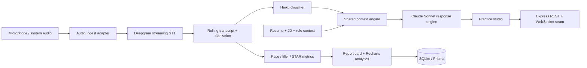

# TeLos

A premium placement-prep product for students: live mock interviews, curated company prep, proctored company assessments, coding drills, analytics, and a community feed.

## What is included

- Electron + React + TypeScript desktop shell, with Tailwind available for incremental utility styling and a bespoke application stylesheet for the polished studio layout.
- Express REST seam (`server/index.ts`) designed to be replaced by a Spring Boot service without changing the desktop UI contract.
- Practice Studio: streaming-style rolling transcript, behavioral coaching, pace/filler metrics, adaptive follow-up endpoint, and end-of-session report card.
- Proctored Assessments: company-specific timed screens, visible camera consent, browser focus and clipboard controls, two-event flagging with third-event auto-submit, and an integrity event record.
- Account access: persistent email/password accounts through Prisma, plus verified Google Identity Services sign-in when `GOOGLE_CLIENT_ID` and `VITE_GOOGLE_CLIENT_ID` are configured.
- Real device interaction in Practice Studio: the **Enable Mic** control requests microphone permission through Electron/Chromium and uses built-in speech recognition where available; **Interviewer Voice** uses browser speech synthesis to read each panel question aloud. Typed responses remain the accessible fallback.
- Analytics dashboard with real API-provided session data rendered through Recharts.
- Seed-ready Prisma/SQLite schema for sessions, questions, scoring snapshots, and a five-problem JusPay N-ary/resource-locking set.
- A seeded `JusPay Hackathon Panelist` persona with an adaptive systems/correctness rubric.
- Problem library for the custom tree-locking practice bank.

## Architecture

## Run it

1. Install Node.js 20+ and copy `.env.example` to `.env`.
2. Run `npm install`.
3. For local persistence, run `npm run db:push && npm run seed`.
4. Start the desktop application with `npm run dev`.

The Express service starts at `http://localhost:8787`, Vite at `http://localhost:5173`, and Electron opens the product window. Use `npm run build` to type-check and build the web bundle.

## Cloud adapter contract

`DEEPGRAM_API_KEY` and `ANTHROPIC_API_KEY` are deliberately optional so the prototype works offline in demo mode. Production adapters should:

1. send PCM frames through the Deepgram streaming client and broadcast partial/final diarized turns over WebSocket;
2. call Haiku with the latest finalized interviewer turn for category tagging;
3. combine the persisted resume/JD context, classifier result, and rolling transcript in a mode-specific Sonnet prompt;
4. persist timestamps and scoring snapshots through Prisma.

The UI API boundary already covers `/api/classify`, `/api/interviewer/next`, `/api/report`, `/api/analytics`, and `/api/problems`.

## Ethics & intended use

**Practice Mode is the shipped product:** an open, permissioned mock-interview environment for rehearsal, feedback, coding practice, and portfolio demonstrations.

**Live Assist is technical R&D only:** this repository does not ship an invisible overlay, bypass platform protections, or attempt to evade proctoring/detection systems. Any future assistive tooling should be used only where explicitly permitted, remain visible/consent-based, and prioritize accessibility coaching over answer generation.

## Data model

`Session` records the context and aggregate outcome. `Question` preserves individual prompts/answers. `Score` records time-series speaking and answer metrics. `Problem` holds the seeded N-ary locking curriculum. See `prisma/schema.prisma`.
